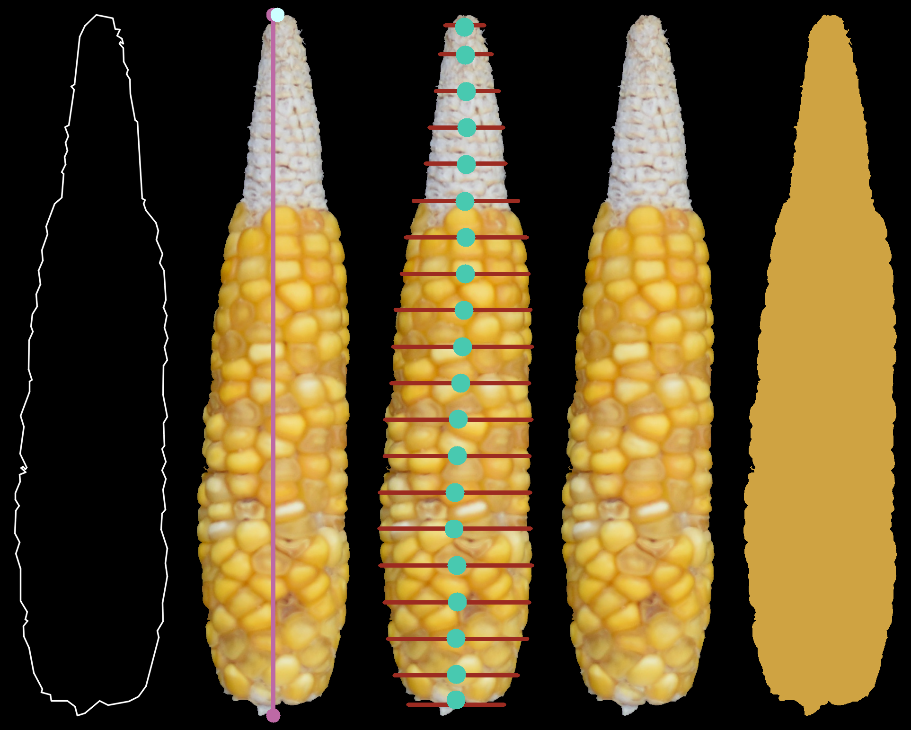
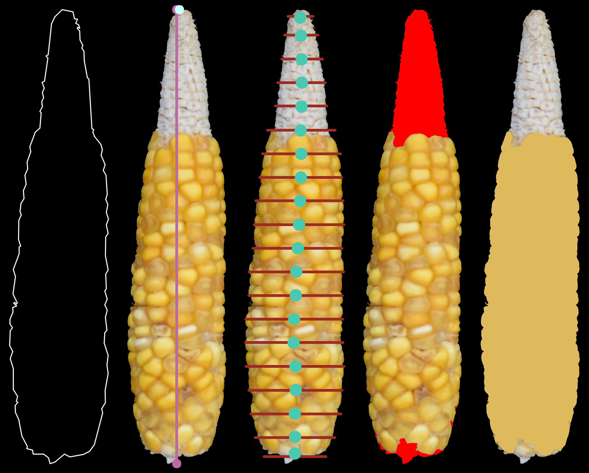

.. highlight:: rst

=====
EarCV
=====

-------------------------------------------------------
A python-based tool for automated maize ear phenotyping
-------------------------------------------------------

This tool allows users to rapidly extract features from images containing maize ears against a uniform background. It was designed with the intention of facilitating analysis of thousands of images with a single command prompt. As output, this tool creates a .csv with features for each ear found in the input image(s) and prints several proofs to monitor tool performance. This packages uses base python, OpenCV 2, PlantCV (Color correction, optional) and Zbar (QR code, optional) functions. 

-----------
Quick Start
-----------

Clone Repo::

 git clone https://github.com/juang0nzal3z/EarCV.git

Run tests from the main ''EarCV/'' folder contianing this repo. Let's use images within the ''/test/'' folder as examples.

^^^^^^^^^^^^^^
Simplest case:
^^^^^^^^^^^^^^
Image only containing a single ear::

	python ./src/main.py -i ./test/IN/test_img_1.JPG -o ./test/OUT/

Output:

.. image:: ./test/OUT/01_Proofs/test_img_1_proof.png
	:height: 2944 px
	:width: 2949 px
	:scale: 1 %
	:alt: alternate text
	:align: right

Now lets run the same image with default cob and shank segmentation::

	python ./src/main.py -i ./test/IN/test_img_1.JPG -o ./test/OUT/ -t -b

Output:

^^^^^^^^^^^^^^^^^^
Full feature case:
^^^^^^^^^^^^^^^^^^

Let's run an image with all of the features using default settings::

	python ./src/main.py -i ./test/IN/test_img_2.png -o ./test/OUT/ -qr -r -clr ./test/IN/clrchr.png -ppm 10 cm -t -b

Output:

.. image:: ./test/OUT/01_Proofs/test_img_2_proof.png
    :alt: alternate text

------------
Installation
------------

^^^^^^^^^^^^
Dependencies
^^^^^^^^^^^^

Clone this repo and make sure you have all the dependencies installed on your python environment of choice. Instructions below are for Linux (Ubuntu). You can use EarCV with WIndows or MacOS as well, instllation of dependencies will vary slightly.

Dependencies:

* OpenCV 2
* Numpy
* Scipy
* Py-zbar (optional, QR code module)
* PlantCV (optional, Color correction module)

For simplicity, use pip for installation of dependecies::

	sudo apt-get install -y python3-pip

I reccomend you use a virtual environment. I like 'virtualenv', but you can use any you like or none at all::

	pip install virtualenv virtualenvwrapper
	nano ~/.bashrc

Add this to your './bashrc' file::

	# virtualenv and virtualenvwrapper
	export WORKON_HOME=$HOME/.local/bin/.virtualenvs
	export VIRTUALENVWRAPPER_PYTHON=/usr/bin/python3
	export VIRTUALENVWRAPPER_VIRTUALENV=$HOME/.local/bin/virtualenv
	source $HOME/.local/bin/virtualenvwrapper.sh

Source your edited './bashrc' file::

	source ~/.bashrc

^^^^^^^^^^
Clone Repo
^^^^^^^^^^
Use this::

	git clone https://github.com/Resende-Lab/EarCV.git

^^^^^^^^^^^^^^
Install OpenCV
^^^^^^^^^^^^^^

Create virtual environment::

	mkvirtualenv OpenCV -p python3

Install OpenCV 2 using pip::

	pip install opencv-contrib-python

Test that the installation worked::

	python3 -c "import cv2; print(cv2.__version__)"

You have installed OpenCV! If this does not work, then try installing from source. You can look this up depending on the operating system you use.

^^^^^^^^^^^^^^^^^^^^^^^^^^^^^^^^^^^
Install Numpy, Scipy, PlantCV, Zbar
^^^^^^^^^^^^^^^^^^^^^^^^^^^^^^^^^^^

Pip install numpy::

	pip3 install numpy

Pip install scipy::

	pip3 install scipy

Verify installation::

	python3 -c "import numpy as np; print(np.__version__) ; import scipy as scipy; print(scipy.__version__)"

To install PlantCV for the color correciton module::

	pip install plantcv

To install Zbar for the QR code module::

	sudo apt-get install libzbar0

-----
Usage
-----
This tool uses any standard image format (.jpg, .jpeg, .png, or .tiff). The main function does the following:

* Segments ears photographed against a uniform background
	- Background can be any color insofar it contrasts well with the ears.
	- Algorithm can take any number of ears, in any configuration or arrangment.
	- Ears may touch slightly in the image.
	- Ears may have silk and other debri.

* For each ear:
	- Extracts basic morphological features
	- Segments cob and shank from kernels
	- Extracts kernel features
	- (in development) Estimates Kernel Row Number
	- (in development) Predicts USDA quality Grade
 
^^^^^
Input
^^^^^

	Required:

	-i, --image      	   Path to input image file, required. Accepted formats: 'tiff', 'jpeg', 'bmp', 'png'.

	Optional:

	-o, --OUTDIR     	   Provide path to directory to save proofs, logfile, and output CSVs. Default: Will save in current directory if not provided.

	-ns, --no_save   	   Default saves proofs and output CSVs. Raise flag to stop saving.

	-np, --no_proof		   Default prints proofs on screen. Raise flag to stop printing proofs.

	-D, --debug     	   Raise flag to print intermediate images throughout analysis. Useful for troubleshooting.

For complete usage documentation run::

	python ./src/main.py -h

^^^^^^
Output
^^^^^^
The output structure is as follows::

	./OUT/
	|--- 01_Proofs/
	|--- 02_Ear_ROIs/
	|--- 03_Ear_Proofs/
	|--- EarCV.log
	|--- qrcode.csv
	|--- color_check.csv
	|--- features.csv

* Proofs
	Use proofs to monitor performance. ''01_Proofs'' documents qr code extraction, color correction, pixels per metric calculation, and ear segmentation. ''02_Ear_ROIs'' contains the region of interest for each segmented ear. ''03_Ear_Proofs'' conatins a proof for each individual ear showing various feature extraction results. 
* EarCV.log
	Every time you run the script, the terminal prints a log of what is happening under the hood.
* qrcode.csv
	File with the image name and the corresponding information found in QR code.
* color_check.csv
	File with color correction preformance metrics based on root mean squared differences in color.
* features.csv
	File with the ear features as columns and ears as rows.

^^^^^^^^^^^^^^^^
Optional modules
^^^^^^^^^^^^^^^^
* QR code extraction
	- Helps you keep track of who is what in what image in your experiment.
	- Scans image for QR code and returns found information.
* Color correction
	- Standizes colors across any number of images to make robust color comparisons.
	- Performs color correction on images using a color checker.
* Pixels per metric conversion
	- Want your morphemetric measurements in inches? centimeters?
	- Converts pixel measurements into any unit of length or area.
	- Calculates the pixels per metric using a solid color square in the input image of known dimensions.

^^^^^^^^^^^^^^^^^^^^
Output: Ear features
^^^^^^^^^^^^^^^^^^^^

Anytime you use this tool you will get the following features:

* Filename					
	Name of image file or QR code if qr code module turned on
* Ear Number				
	If image conatins multiple ears, each ear gets an ear number.
* Ear_Area					
	The area of the entire ear. 
* Ear_Box_Area				
	Area of the smallest bounding box containing the ear.
* Ear_Box_Length
	Length of the smallest bounding box containing the ear.
* Ear_Box_Width:
	Width of the smallest bounding box containing the ear.
* Max_Width:
	Width is measured 20 evenly-spaced slices along the length of the ear. Gives the widest part of the ear.
* perimeters:
	Perimeter of the ear contour
* Convexity:
	Ratio of ear perimeter over convex hull perimeter.
* Solidity:
	Ratio of ear area over the convex hull area.
* Convexity_polyDP:
	Ratio of smoothed ear perimeter over convex hull perimeter.
* Taper:
	Standard deviations of the 10 slices along the top half of the ear.
* Taper_Convexity:
	Ratio of perimeter over convex hull perimeter of the top half of the ear.
* Taper_Solidity:
	Ratio of area over the convex hull area of the top half of the ear.
* Taper_Convexity_polyDP:
	Ratio of smoother perimeter over convex hull perimeter of the top half of the ear.
* Widths_Sdev:
	Standard deviation of the width of 20 evenly-spaced slices along the length of the ear.
* Cents_Sdev:
	Standard deviation of the midpoint of 20 evenly-spaced slices along the length of the ear.
* Tip_Area:
	If cob segementation is turned on: Area of the cob tip. Excludes kernels
* Bottom_Area:
	If cob segementation is turned on: Area of the bottom of the ear. Excludes kernels.
* Krnl_Area:
	If cob segementation is turned on: Area of the kernel portion of the ear.
* Kernel_Length:
	If cob segementation is turned on: Length of the smallest bounding box containing the kenrnels.
* Krnl_Convexity:
	If cob segementation is turned on: Ratio of ear perimeter over convex hull perimeter containing the kenrnels.
* Tip_Fill:
	If cob segementation is turned on: Ratio of tip cob area over total ear area.
* Bottom_Fill:
	If cob segementation is turned on: Ratio of bottom cob area over total ear area.
* Krnl_Fill:
	If cob segementation is turned on: Ratio of kernel area over total ear area.
* Blue: 
	Pixel intensity value of entire ear. If cob segementation is turned on: Pixel intensity value of kernel.
* Red:
	Pixel intensity value of entire ear. If cob segementation is turned on: Pixel intensity value of kernel.
* Green: 
	Pixel intensity value of entire ear. If cob segementation is turned on: Pixel intensity value of kernel.
* Hue: 
	Pixel intensity value of entire ear. If cob segementation is turned on: Pixel intensity value of kernel.
* Sat: 	
	Pixel intensity value of entire ear. If cob segementation is turned on: Pixel intensity value of kernel.
* Vol: 
	Pixel intensity value of entire ear. If cob segementation is turned on: Pixel intensity value of kernel.
* Light: 
	Pixel intensity value of entire ear. If cob segementation is turned on: Pixel intensity value of kernel.
* A_chnnl:
	Pixel intensity value of entire ear. If cob segementation is turned on: Pixel intensity value of kernel.
* B_chnnl:
	Pixel intensity value of entire ear. If cob segementation is turned on: Pixel intensity value of kernel.

----------
Main Usage
----------

Full pipeline for automted maize ear phenotyping

main.py [-h] -i IMAGE [-o OUTDIR] [-ns] [-np] [-D] [-qr] [-r]
        [-qr_scan [Window size of x pixels by x pixels]
        [Amount of overlap 0 < x < 1]] [-clr COLOR_CHECKER]
        [-ppm [reference length]]
        [-filter [Min area as % of total image area]
        [Max Area as % of total image area] [Max Aspect Ratio]
        [Max Solidity]] [-clnup [Max area COV] [Max iterations]]
        [-slk [Min delta convexity change] [Max iterations]]
        [-t [Tip percent] [Contrast] [Threshold] [Close]]
        [-b [Bottom percent] [Contrast] [Threshold] [Close]]

  -h, --help            show this help message and exit
  -i IMAGE, --image IMAGE
                        Path to input image file (required)
  -o OUTDIR, --outdir OUTDIR
                        Provide directory to saves proofs, logfile, and output
                        CSVs. Default: Will save in current directory if not
                        provided.
  -ns, --no_save        Default saves proofs and output CSVs. Raise flag to
                        stop saving.
  -np, --no_proof       Default prints proofs on screen. Raise flag to stop
                        printing proofs.
  -D, --debug           Raise flag to print intermediate images throughout
                        analysis. Useful for troubleshooting.
  -qr, --qrcode         Raise flag to scan entire image for QR code.
  -r, --rename          Default renames images with found QRcode. Raise flag
                        to stop renaming images with found QRcode.
  -qr_scan [Window size of x pixels by x pixels] [Amount of overlap (0 < x < 1)], --qr_window_size_overlap [Window size of x pixels by x pixels] [Amount of overlap (0 < x < 1)]
                        Provide the size of window to scan through image for
                        QR code and the amount of overlap between sections(0 <
                        x < 1).
  -clr COLOR_CHECKER, --color_checker COLOR_CHECKER
                        Path to input image file with reference color
                        checker.
  -ppm [reference length], --pixelspermetric [reference length]
                        Calculate pixels per metric using either a color
                        checker or the largest uniform color square. Provide
                        reference length.
  -filter [Min area as % of total image area] [Max Area as % of total image area] [Max Aspect Ratio] [Max Solidity], --ear_filter [Min area as % of total image area] [Max Area as % of total image area] [Max Aspect Ratio] [Max Solidity]
                        Ear segmentation filter. Default: Min Area--1 percent,
                        Max Area--x percent, Max Aspect Ratio: x < 0.6, Max
                        Solidity: 0.98. Flag with three arguments to customize
                        ear filter.
  -clnup [Max area COV] [Max iterations], --ear_cleanup [Max area COV] [Max iterations]
                        Ear clean-up module. Default: Max Area Coefficient of
                        Variation threshold: 0.2, Max number of iterations:
                        10. Flag with two arguments to customize clean up
                        module.
  -slk [Min delta convexity change] [Max iterations], --silk_cleanup [Min delta convexity change] [Max iterations]
                        Silk decontamination module. Default: Min change in
                        covexity: 0.04, Max number of iterations: 10. Flag
                        with two arguments to customize silk clean up module
  -t [Tip percent] [Contrast] [Threshold] [Close], --tip [Tip percent] [Contrast] [Threshold] [Close]
                        Tip segmentation module. Tip percent, Contrast,
                        Threshold, Close. Flag with four arguments to
                        customize tip segmentation module. Turn of module by
                        providing '0' for all arguments
  -b [Bottom percent] [Contrast] [Threshold] [Close], --bottom [Bottom percent] [Contrast] [Threshold] [Close]
                        Bottom segmentation module. Bottom percent, Contrast,
                        Threshold, Close. Flag with four arguments to
                        customize tip segmentation module. Turn of module by
                        providing '0' for all arguments
------------------
QR code extraction
------------------

Scans image for QR code and extracts information using pyzbar's decode function.

* Parameters

	qr_img : array_like
		Valid file path to image to be scanned for QR code. Accepted formats: 'tiff', 'jpeg', 'bmp', 'png'.

	qr_window_size: float
		Optional. Dimension of square window size to scan over original image.

	overlap: float
		Optional. Amount of overlap between windows. Must be a decimal between 0 & 1. The higher the number the more overlap between windows and higher scanning resolution but longer analysis.

	debug: bool
		If true, print images.

* Returns

	QRcodeType
	QRcodeData
	QRcodeRect
	qr_count
	qr_proof

* References

	Thank you zbar! http://zbar.sourceforge.net/index.html

* Examples

	Example 1::

		python qr.py test_img_2.png None None False

	Example 2::

		python qr.py test_img_2.png 2000 0.01 True

----------------
Color correction
----------------
Corrects the color of an image that contains a color checker based on reference. This tool can optionally use any reference image of a color checker for color correction. You may use the provided reference in this package called 'clrchr.png'. Credit to: Nayanika Ghosh <https://github.com/juang0nzal3z/EarCV/tree/main/ColorHomography>

* Parameters

	filename : array_like
	    Valid file path to image to be color corrected. Accepted formats: 'tiff', 'jpeg', 'bmp', 'png'.

	reff_name: array-like
	    Valid file path to reference image to be used as ground truth for color correction. Accepted formats: 'tiff', 'jpeg', 'bmp', 'png'.

	debug: bool
	    If true, print output proof images.

* Returns

	tar_chk: 
	    Image: color checker mask from original image to to corrected
	corrected: 
	    Image: Image after color checker correction
	avg_tar_error: 
	    Int. RMS error of original color checker
	avg_trans_error:
	    Int. RMS error after color correction
	csv_field:
	    Vector of 26 values containing correction metrics to asses performance:
	    'Filename', 'Overall improvement', 'Square1', 'Square1', 'Square3', 'Square4', 'Square5', 'Square6',
	    'Square7', 'Square8', 'Square9', 'Square10', 'Square11', 'Square12', 'Square13', 'Square14',
	    'Square15', 'Square16', 'Square17', 'Square18', 'Square19', 'Square20', 'Square21', 'Square22', 'Square23', 'Square24'

* References

	.. [1] Algorithm based on: <https://homepages.inf.ed.ac.uk/rbf/PAPERS/hgcic16.pdf>

* Example::

	python ppm.py test_img_2.png 100

------------------------
Pixels per metric module
------------------------
This tool allows the user to convert any 1D or 2D measurements from pixels to a know unit by providing a reference in the image. The reference must be a solid color square known dimensions. (Optional) Any square within a color checker may be used.

* Parameters
	filename : array_like
	    Valid file path to image. Accepted formats: 'tiff', 'jpeg', 'bmp', 'png'.
	pixelspermetric: float
	    reference length of largest square in image in any lenght unit of interest.

* Returns
	PixelsPerMetric
	    Number of pixels per unit reference provided (centimeters, inches, etc.)
	ppm_proof
	    Image showing the largest square and its ppm conversion ratio

* References
	[1] Adrian Rosebrock, OpenCV, PyImageSearch, <https://www.pyimagesearch.com/>, accessed on 01 January 2020

* Examples::

	python colorcorrection.py test_img_2.png False